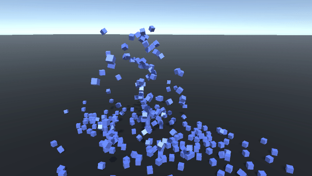

# Better GameObject Pooling In Unity

> [Link to a GitHub gist](https://gist.github.com/stillwwater/7b9d08f18c7f9923094c32f31dca75e8) with the code in this post. I’ve also included an [example](#a/better-object-pooling/usage) on how you could use the pool.



If you’ve ever needed to create a large number of game objects and then subsequently destroy them after some short period of time in Unity, you know that `GameObject.Instantiate` and `GameObject.Destroy` are too expensive to be called repeatedly. So you search in the Unity forums for a solution and find that what you really want is to instantiate objects once, and disable objects instead of destroying them, so that they can be reused. 

What you want is to *pool* game object instances. Unfortunately most implementations I’ve seen floating around are not that great. These are often implemented with a singleton component that you have to add to every single scene that either keeps *all* objects in the same pool or uses some `Dictionary` to find a specific pool using a key

Most of the time we are only interested in some component (like a `Transform`) in the pooled game object, so instead of storing `GameObjects` we can store a reference to a component. A benefit of storing references components is we avoid having to call `GetComponent<T>()` on the object returned from the pool. We do this by making  a generic pool type.

```csharp
class Pool<T> where T : Component
{
    readonly List<T> pool;
    readonly T prefab;
    readonly Transform parent;
    
    int id;
 
    public Pool(T prefab, Transform parent = null) {
        Debug.Assert(prefab != null);
        this.parent = parent;
        this.prefab = prefab;
        this.pool = new List<T>();
    }
    
    public int Count => pool.Count;
}
```

`where T : Component` ensures we don’t try to create a pool for something that isn’t a component, we also need this to use methods defined in `Component`. Note that `MonoBehaviour` inherits from `Component` so you can pool your behaviours as well.

We use a list to keep the actual elements in the pool, nothing special here it just lets our pool grow if it needs to.

The parent is optional but it means that the objects instantiated by the pool won’t clutter the Editor hierarchy. The `id` field is also optional, we’ll use it to generate unique names for the instantiated objects.

Next we need some way to instantiate the game objects and add them to the list.

```csharp
// Increases number of objects in the pool by an amount
// that's greater or equal to capacity. If capacity is
// less than or equal to `pool.Count` this method does nothing.
public void Reserve(int capacity) {
    int delta = capacity - pool.Count;
    if (delta > 0) {
        Grow(delta);
    }
}

// Resizes the pool to contain exactly `count` objects.
public void Resize(int count) {
    if (count > pool.Count)
        Grow(count - pool.Count);
    else if (count < pool.Count)
        Shrink(pool.Count - count);
}

void Grow(int amount) {
    pool.Capacity += amount;
    for (int i = 0; i < amount; i++) {
        var go = GameObject.Instantiate(prefab, parent);       
        go.name = prefab.name + (id++).ToString("x4");
        go.gameObject.SetActive(false);
        pool.Add(go);
    }
}
```

For 99% of use cases we’ll be using `Reserve()`, but you may occasionally need to to resize the pool to an exact size using `Resize()`. `Reserve()` instantiates more objects to ensure we have at least a certain number of objects in the pool. Game objects are instantiated in `Grow()`, we deactivate the object immediately when it’s instantiated and add it to the pool.

> Since we know how many elements we’ll be adding to the list we can set `pool.Capacity` ourselves to potentially reduce the number of reallocations done by `List` ([list.cs:110](https://referencesource.microsoft.com/#mscorlib/system/collections/generic/list.cs,110)).

For completeness here is the `Shrink()` method that is called if `Resize()` is called with a count that is less than the number of objects in the pool.

```csharp
void Shrink(int amount) {
    Debug.Assert(amount <= pool.Count);
    for (int i = 0; i < amount; i++) {
        var go = pool[pool.Count - 1];
        pool.RemoveAt(pool.Count - 1);
        GameObject.Destroy(go.gameObject); 
    }
}
```

> Note that the calling `RemoveAt` with the index of the last element is a constant time operation, it will just decrement `pool.Count` ([list.cs:877](https://referencesource.microsoft.com/#mscorlib/system/collections/generic/list.cs,877)).

Next we need a way to retrieve objects from the pool. We make sure to activate the object before returning it.

```csharp
// Retrieves an instance from the pool. If the pool is empty it
// will instantiate and new object and return it.
public T Retrieve() {
    if (pool.Count == 0) {
        // Increase number of elements
        Grow(1);
    }
    var go = pool[pool.Count - 1];
    pool.RemoveAt(pool.Count - 1);
    go.gameObject.SetActive(true);
    return go;
}
```

We need to handle the case where the pool is empty. I’ve chosen to simply call `Grow(1)` to increase the size of the pool, but you may choose to throw an error or log a warning here to force `Reserve()` to be called to grow the pool.

To put an object back in the pool we call `Free()` with the object instance that was returned from `Retrieve()`.

```csharp
// Returns an object back to the pool to be reused.
public void Free(T go) {
    Debug.Assert(go != null);
    go.gameObject.SetActive(false);
    pool.Add(go);
}
```

Finally we can add a convenient way to call `GameObject.Destroy()` on all objects still referenced by the pool.

```csharp
// Destroys all objects in the pool.
public void Clear() {
    foreach (var go in pool) {
        GameObject.Destroy(go.gameObject);
    }
    pool.Clear();
}
```

And that’s it, we don’t use a single instance to manage all pools since each pool is generally tied to a single component. Instead you can just add a pool to whatever component needs to pool objects (such as in the `Spawner` example below). Our pool is just a fancy wrapper around a `List` , so there is little memory overhead in using it. The methods we care about, that is `Retrieve` and `Free`, simply remove or add an element to the end of a `List` and call `SetActive`, making them very fast and suitable to being called every frame.

## Usage

Below is the code for the demo gif at the beginning of this post.

```csharp
class Spawner : MonoBehaviour
{
    [SerializeField] Rigidbody prefab = null;
    [SerializeField] [Range(0f, 10f)] float lifetime = 5f;
    [SerializeField] int count = 300;

    Pool<Rigidbody> pool;

    void Start() {
        pool = new Pool<Rigidbody>(prefab, transform);
        pool.Reserve(count);

        // I do not advocate creating 300 coroutines...
        // this is just a bit of fun :P
        for (int i = 0; i < count; i++) {
            StartCoroutine(Spawn(i / (float)count + i / lifetime));
        }
    }

    IEnumerator Spawn(float delay)  {
        yield return new WaitForSeconds(delay);
        var wait = new WaitForSeconds(lifetime);

        while (true) {
            // Get a reference to a Rigidbody component
            var rb = pool.Retrieve();

            // Reset the transform since the object returned might
            // be in some unknown state.
            var tf = rb.gameObject.transform;
            tf.position = transform.position;
            tf.rotation = Quaternion.identity;

            rb.velocity = new Vector3 {
            	x = Random.Range(-0.2f, 0.2f),
                y = Random.Range(5f, 10f),
            	z = Random.Range(-0.2f, 0.2f),
            };
            yield return wait;

            // Return the component to the pool so it can be reused
            pool.Free(rb);
        }
    }
}

```

## Alternatives

In this implementation objects returned from `Retrieve()` are transferred to whoever called the method, this means the pool no longer keeps track of the object, making the caller responsible for the object. An alternative to this design is to have two lists in the pool, one for the objects that are inactive, and one for active objects returned from `Retrieve()`. This is more expensive since now whenever we call `Free(go)` we need to look up `go` in the active list and move it to the inactive list, but it gives us some extra safety since now only objects created by the pool can be used with `Free()`. This also means that `Clear()` could now destroy all objects that were created by the pool (not just the inactive ones), whether that is a benefit to you or not depends on what you’re trying to do.